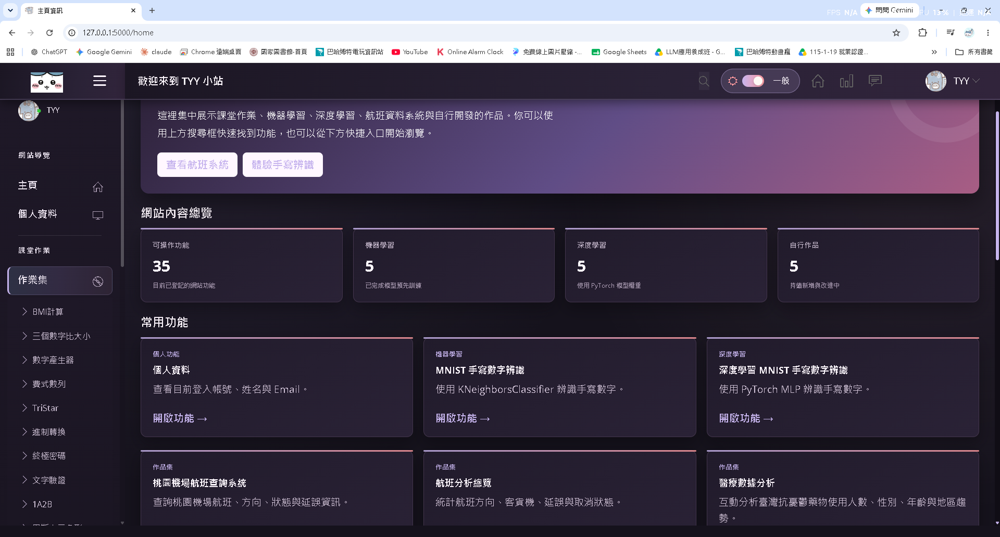
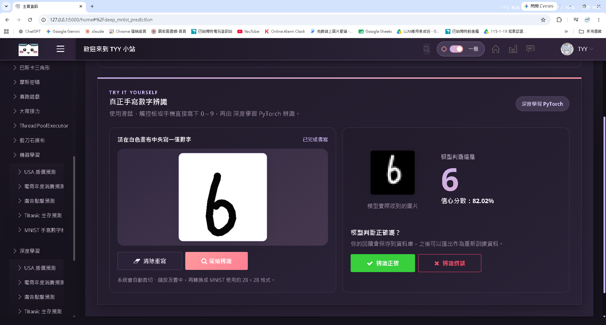
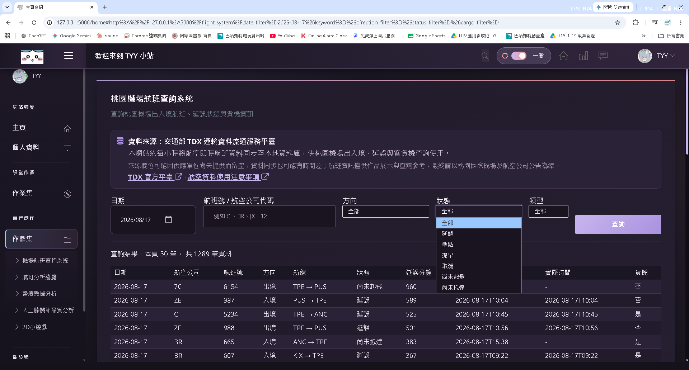
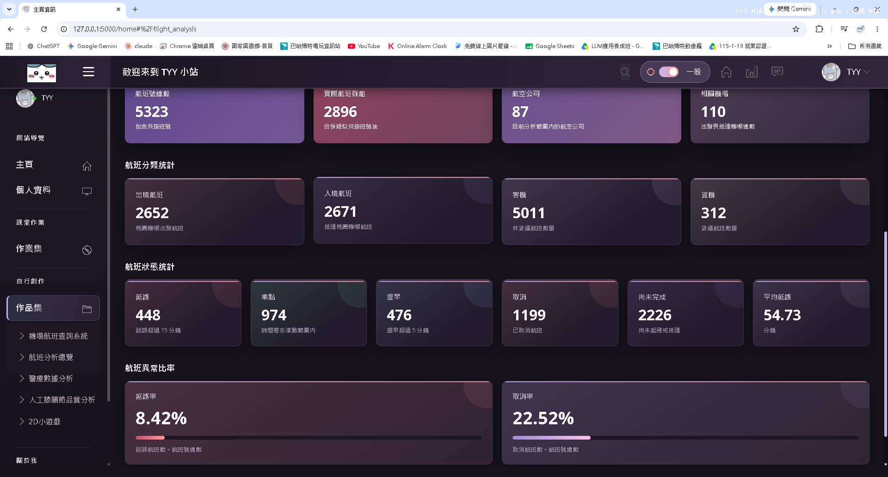
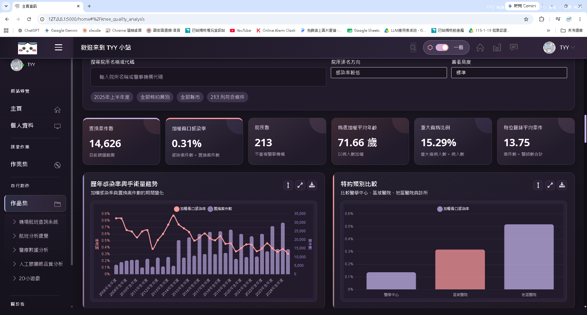
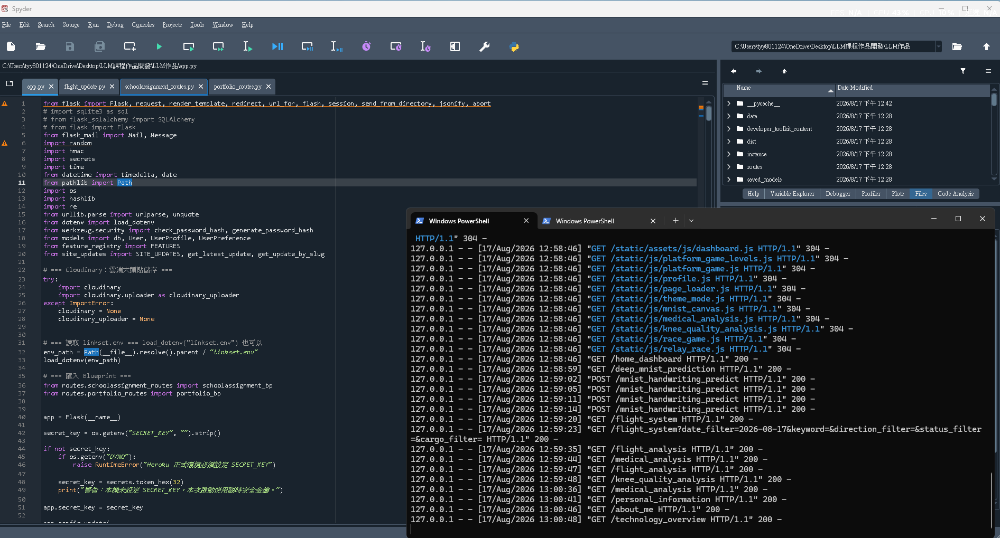

# Python 資訊系統與資料應用作品集
### Python System & Data Application Portfolio

這是一個以 **Python / Flask / SQL** 為核心的學習與個人專案作品集，整合 Web 系統、API 資料串接、資料庫、資料分析、機器學習與深度學習功能。

> 專案定位：課程學習與自主實作作品。主要用於展示後端開發、資料處理、API 串接、資料庫應用與問題排查能力。

## 主要技術

- **Backend**：Python、Flask、Flask Blueprint
- **Database**：SQLAlchemy、SQLite；部署環境可使用 MariaDB
- **Data / API**：Pandas、NumPy、Requests、TDX API
- **Machine Learning**：scikit-learn、joblib
- **Deep Learning**：PyTorch
- **Web**：HTML、CSS、JavaScript
- **Deployment**：Gunicorn、Heroku 設定檔
- **Testing / Security basics**：pytest、CSRF 驗證、環境變數管理

## 代表功能

### 1. 桃園機場航班資料整合與查詢
- 串接 TDX 航空資料 API
- 航班資料清洗與整理
- 條件查詢與航班資訊呈現
- 航班統計與分析 Dashboard

### 2. 醫療資料分析
- 公開資料讀取與前處理
- 條件篩選、統計指標與視覺化
- 人工膝關節品質資料分析

### 3. Machine Learning / Deep Learning
- 房價預測
- 電商消費預測
- 廣告資料預測
- Titanic 生存預測
- MNIST 手寫數字辨識
- PyTorch 深度學習模型推論

### 4. Web / Backend 功能
- Flask 路由與 Blueprint 模組化
- 會員與個人資料相關功能
- SQLAlchemy 資料庫操作
- API、資料處理與模型功能整合
- 基礎測試與錯誤排查

## Screenshots

### 作品總覽


### MNIST 深度學習手寫辨識


### 航班查詢


### 航班分析


### 醫療資料分析


### Flask 後端與 Server Log


## 專案結構

```text
.
├─ app.py                     # Flask 主程式
├─ models.py                  # SQLAlchemy models
├─ feature_registry.py        # 功能註冊
├─ routes/
│  ├─ portfolio_routes.py     # 作品集功能
│  └─ schoolassignment_routes.py
├─ templates/                 # Jinja templates
├─ static/                    # Frontend assets
├─ data/                      # 公開 / 練習資料
├─ saved_models/              # 已訓練模型
├─ tests/                     # 基礎測試
├─ flight_update.py           # TDX 航班 ETL / 更新
├─ get_tdx_flight.py          # TDX API 取得資料
└─ requirements.txt
```


## 航班資料手動更新

「桃園機場航班查詢系統」頁面提供 **手動更新航班資料** 按鈕。

- 正式環境：設定 `CLIENT_ID` / `CLIENT_SECRET` 後，可直接呼叫交通部 TDX API，清洗資料並同步寫入資料庫。
- GitHub Demo：基於憑證安全不附 TDX API 帳密，因此按鈕會顯示 Demo 說明，不執行外部 API 更新。
- Repository 仍保留去識別化的航班資料快照，方便面試主管直接查看查詢與分析功能。

## 公開展示資料

公開版保留一份**已去識別化的展示資料庫** `user_data.db`，讓航班查詢與航班分析功能下載後即可看到資料。

保留內容：
- TDX 航班資料
- 航空公司與機場代碼
- 航班狀態與延誤資料
- Demo 登入帳號

已刪除內容：
- 原作者私人帳號與 Email
- 電話、地址、個人檔案
- 原使用者偏好
- MNIST 使用者回饋紀錄

Demo 帳號：

```text
帳號：demo
密碼：demo1234
```

另外保留 `clean_tpe_flights.json` 與 `tdx_tpe_flights.json` 作為航班資料快照。
即使沒有 TDX API 憑證，也可以先查看既有資料；若要更新最新航班，再自行設定 TDX API。

## Demo 登入帳號

公開作品版本會自動建立一組展示用帳號：

```text
帳號：demo
密碼：demo1234
```

這組資料**不是私人帳號或真實服務憑證**，僅供作品展示使用。

若部署到公開環境，可在環境變數設定：

```text
DEMO_ENABLED=1
DEMO_USERNAME=demo
DEMO_PASSWORD=自行設定的展示密碼
DEMO_NAME=作品展示帳號
DEMO_EMAIL=demo@example.com
```

若不需要 Demo 登入：

```text
DEMO_ENABLED=0
```


## 本機執行

### 1. 建立虛擬環境

```bash
python -m venv .venv
```

Windows：

```bash
.venv\Scripts\activate
```

### 2. 安裝套件

```bash
python -m pip install -r requirements.txt
```

### 3. 建立環境設定

複製：

```text
.env.example -> linkset.env
```

依需要填入自己的 TDX / Mail / Cloudinary 設定。

### 4. 啟動

```bash
python app.py
```

## 資料與模型說明

- 為避免將大型訓練資料直接放入 GitHub，`mnist_train.csv` 不包含在公開版本。
- 已訓練模型保留於 `saved_models/`，部分功能可直接進行推論。
- Repository 保留去識別化的展示用航班資料庫與資料快照，原始私人使用者資料已移除。
- 即時更新 TDX 資料需要自行設定 API 憑證。
- 部分功能需要外部 API 或環境變數，未設定時可能無法完整使用。

## 安全性

公開版本不包含：
- API Key / Client Secret
- Email App Password
- 原始私人使用者資料與真實服務憑證
- `.env` / `linkset.env`
- 即時抓取產生的本機資料檔

所有私密設定皆應透過環境變數提供。

## About

這個專案主要用於記錄從 Python 基礎、資料分析一路延伸至 Web 後端、資料庫、API 與 ML/DL 應用的學習與實作成果。
